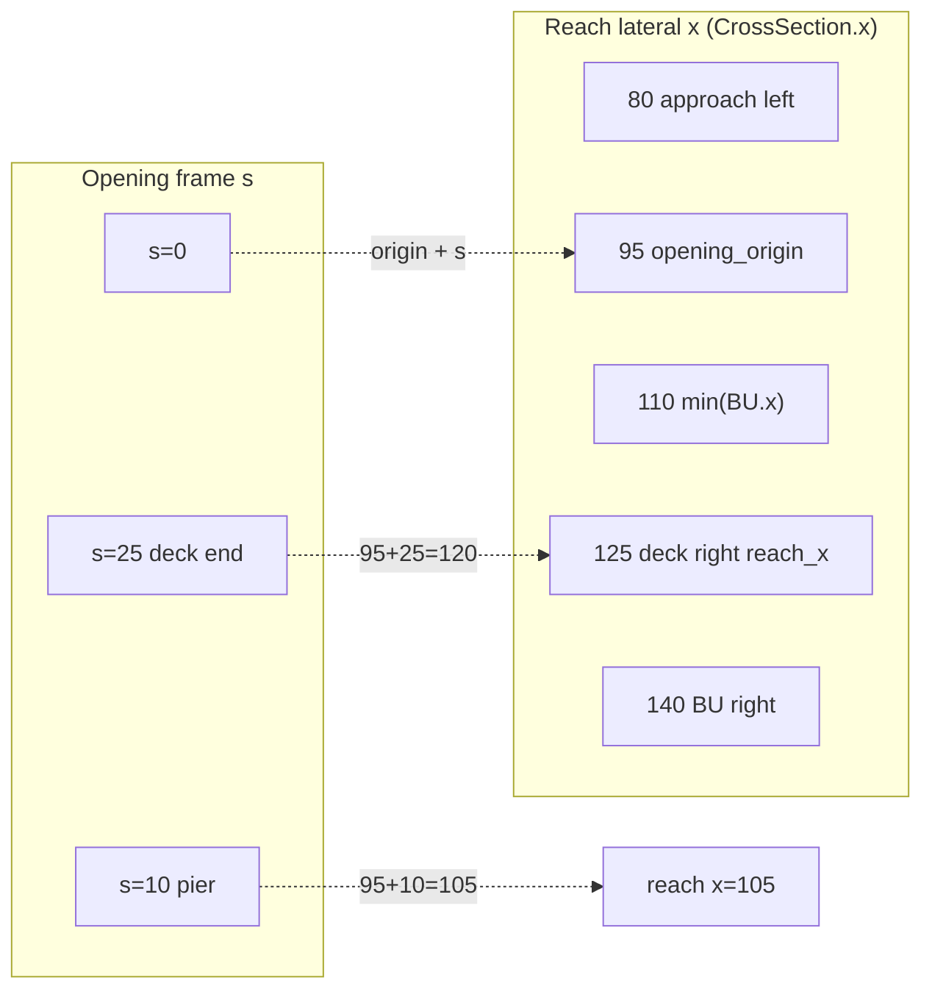

# Bridge interior cross sections (API v22) — design

HEC-RAS models bridge hydraulics with dedicated cross-section cuts at the bridge faces and optional interior cuts between deck limits. STREAM-1D phase **1.2** adds optional explicit **BU** (bridge upstream), **BD** (bridge downstream), and **internal** sections, plus a station-alignment field linking bridge opening coordinates to reach cross-section lateral stations.

## HEC-RAS concepts

| Cut | HEC-RAS name | Role |
|-----|--------------|------|
| Reach XS immediately upstream of structure | Approach | Standard reach geometry before the bridge |
| **BU** | Bridge upstream face | Opening geometry at the US face (piers, abutments, deck soffit encoded in the cut or via bridge fields) |
| **Internal** | Bridge interior | Optional cuts between BU and BD (multi-span, variable deck) |
| **BD** | Bridge downstream face | Opening geometry at the DS face |
| Reach XS immediately downstream | Departure | Standard reach geometry after the bridge |

Today (pre-v22), the steady/unsteady solvers use **reach interval geometry** — the densified cross sections bracketing `bridge_stations[i]` — for bridge area/conveyance. That matches simple models but diverges from HEC-RAS when BU/BD cuts differ from the adjacent reach polylines.

## Coordinate frames

Two horizontal frames are in play:

1. **Reach XS stations** — `CrossSection.x` lateral coordinates on any reach or bridge cut (feet/meters, user units).
2. **Bridge opening stations** — origin at the **left edge of the deck opening**, increasing rightward. Used by `bridge_deck_*`, `bridge_pier_stations`, `bridge_abutment_*`, and ineffective blocks.

**Alignment** maps opening station `s` to reach XS lateral coordinate:

```text
reach_x = opening_origin + s
```

where `opening_origin` is the reach lateral `x` at opening station 0 (stored on `BridgeSectionContext.opening_reach_station_origin`).

### Coordinate convention diagram (§1.3)

Three independent axes appear in bridge inputs. Do not mix them in one array.

| Axis | Field / symbol | Units | Monotonic | Example |
|------|----------------|-------|-----------|---------|
| **Longitudinal** | `CrossSection.station`, `bridge_stations`, `bridge_opening_anchor_reach_stations` | user length (ft or m) | upstream → downstream (decreasing station on a typical reach grid) | BU at river station `52`, bridge center `50` |
| **Reach lateral** | `CrossSection.x`, resolved `opening_origin`, remapped deck/pier/abutment stations | user length | left → right looking downstream | Approach `x = 80…150`, BU `x = 110…140` |
| **Opening** | `bridge_deck_stations`, `bridge_pier_stations`, `bridge_abutment_*_stations`, `bridge_ineffective_*` | user length | `0` = left deck edge, increasing rightward | Pier at opening `s = 10` |

#### Longitudinal (plan of the reach)

```text
flow ───────────────────────────────────────────────► downstream

river station:   100        52 (BU)    50 (bridge center)    48 (BD)        0
                 │            │              │                   │              │
reach XS:    [approach]   [BU cut]     (metadata)          [BD cut]     [departure]
```

Bridge hydraulics use the **BU → BD** interval on the densified grid, not the wider interval around `bridge_stations` alone.

#### Lateral — reach `x` vs opening `s` (plan, looking downstream)

When the left deck edge is **not** `min(BU.x)`, set an explicit origin or anchor mode so HEC-RAS opening data maps correctly.



ASCII equivalent (same numeric example as `tests/bridge_opening_alignment_verification.rs`):

```text
Reach lateral x (meters, increasing right)
│
│   approach          opening_origin              BU cut
│   x=80              x=95                      x=110──────────────x=140
│    │                 │   ▲ s=0                  │◄─── deck on BU ───►│
│    │                 │   │                      │                    │
│    └─────────────────┼───┼──────────────────────┼────────────────────┘
│                      │   │    pier s=10        │
│                      │   └──► reach x = 95+10 = 105
│                      │
│                      └── bridge_opening_reach_station_origins[b] = 95
│                          (15 m left of min(BU.x); typical HEC-RAS offset import)

Opening frame s (host / HEC-RAS bridge editor — always relative to left deck edge):
  s=0          s=10 (pier)              s=25 (deck right)
  ├──────────────┬────────────────────────┤
  0              10                       25

Preprocessor (before hydraulics):
  reach_x = opening_origin + s     →   deck [0,25] becomes [95,120]
                                       pier 10 becomes 105
```

**Default (no offset):** omit anchor fields → `opening_origin = min(BU.x)` → opening `s` equals reach `x` measured from the BU left edge.

**Skew** (`bridge_skew_angles`, 0–59°) does not change the station mapping above. It scales **perpendicular** abutment widths and pier/deck **projected** lengths in the solver ($W' = W/\cos\theta$, friction $L' = L/\cos\theta$). Opening stations remain in the opening-aligned frame.

#### Which fields live in which frame?

| Input | Frame | Remapped when `opening_origin` set? |
|-------|-------|-----------------------------------|
| `CrossSection.x` on reach / BU / BD | Reach lateral | No (already reach `x`) |
| `CrossSection.ineffective_flow_areas` on BU/BD cut | Reach lateral | No |
| `bridge_deck_*`, `bridge_pier_stations` | Opening | Yes → reach `x` |
| `bridge_abutment_*_stations`, top profiles | Opening | Yes → reach `x` |
| `bridge_ineffective_*` (bridge-level) | Opening | Yes → reach `x` (per face) |
| `bridge_opening_reach_station_origins` | Reach lateral (`x` at `s=0`) | N/A (defines origin) |

Validate before solve: `validateSteadyInputs` → `{ warnings }` if the reach-frame deck/pier/abutment span exceeds the parent BU (or approach) `min(x)…max(x)`.

### Opening anchor modes (API v23, checklist §1.3)

Hosts can anchor opening station 0 without manual offset math:

| Mode | `bridge_opening_anchor_modes[b]` | Required fields | Resolved `opening_origin` |
|------|----------------------------------|-----------------|---------------------------|
| **BU left** (default) | `0` or omit | — | `min(BU.x)` on resolved BU; else `min(reach US.x)` |
| **Reach river station** | `1` | `bridge_opening_anchor_reach_stations[b]` | `min(x)` on the reach XS at that longitudinal station (densified grid lookup) |
| **Explicit lateral `x`** | `2` | `bridge_opening_reach_station_origins[b]` | That value |

**Precedence:** `bridge_opening_reach_station_origins[b]` always wins when set (backward compatible with v22).

**HEC-RAS import mapping:**

1. **BU left** — deck/pier/abutment stations from the bridge editor are relative to the left edge of the opening on the BU cut; omit anchor fields when BU `min(x)` matches HEC-RAS station 0.
2. **Reach river station** — when HEC-RAS ties opening coordinates to an approach/departure cross section (not BU), set `bridge_opening_anchor_modes[b]: 1` and `bridge_opening_anchor_reach_stations[b]` to that reach river station. The engine looks up the densified node at that station and uses `min(CrossSection.x)` as the origin.
3. **Explicit lateral `x`** — when the left deck edge is not `min(BU.x)`, set `bridge_opening_reach_station_origins[b]` to the reach lateral coordinate of opening station 0 (v22 behavior).

**Preprocessor (§1.3.2):** When `opening_origin` is resolved, the engine maps opening-frame inputs to reach lateral `x` before bridge hydraulics:

| Input | Remap |
|-------|--------|
| `bridge_ineffective_*` | Shifted in `resolve_face_ineffective` (upstream/downstream faces) |
| `bridge_pier_stations` | Shifted on `BridgeSectionContext` before `build_bridge_geometry` |
| `bridge_deck_stations` | Shifted on `BridgeDeckProfile` in `build_bridge_geometry` |
| `bridge_abutment_*_stations` / top profiles | Shifted on `BridgeAbutmentUserInput` before `resolve_abutments` |

When `opening_origin` is omitted (legacy), opening coordinates are treated as identical to reach `x`.

### Validation (§1.3)

`validateSteadyInputs` returns `{ warnings: string[] }` (non-fatal). When bridge deck/abutment/pier geometry defines a horizontal opening span, the engine compares the reach-frame extent to the parent cross-section lateral bounds:

| Parent XS (priority) | Used when |
|----------------------|-----------|
| BU upstream face | `bridge_upstream_cross_sections[b]` present |
| Anchor reach XS | `bridge_opening_anchor_reach_stations[b]` matches a reach cut |
| Upstream reach face | Reach section upstream of `bridge_stations[b]` |

Example warning: `Bridge 0: opening lateral extent [100.0000, 135.0000] exceeds parent cross-section x range [100.0000, 130.0000] (BU upstream face)`.

## WASM / JSON fields (API v22)

Parallel per-bridge arrays on **`SteadyInputs`**, nested under **`UnsteadyInputs.bridge`**, and discoverable via `getWasmApiMetadata().bridge_fields.inputs`.

| Field | Shape | Description |
|-------|-------|-------------|
| `bridge_upstream_cross_sections` | `[bridge]` → `CrossSection` | **BU** cut. Overrides reach US interval geometry for bridge hydraulics when present. |
| `bridge_downstream_cross_sections` | `[bridge]` → `CrossSection` | **BD** cut. Overrides reach DS interval geometry. |
| `bridge_internal_cross_sections` | `[bridge][section]` → `CrossSection` | Optional interior cuts, ordered **US → DS**. Stored for metadata and future multi-segment hydraulics; **not yet used in the solver Jacobian** (phase 1.3+). |
| `bridge_opening_reach_station_origins` | `[bridge]` | Reach `x` at opening station 0 (explicit anchor). Overrides mode when set. |
| `bridge_opening_anchor_modes` | `[bridge]` | `0` = BU left, `1` = reach river station, `2` = explicit lateral `x` (requires origins). |
| `bridge_opening_anchor_reach_stations` | `[bridge]` | Longitudinal reach river station for mode `1` (user units, must exist on densified grid). |

`CrossSection.station` on BU/BD/internal cuts is **informational** (bridge face reach station); hydraulics use the polyline (`x`, `y`, `n_*`, `blocked_obstructions`, `is_overbank`, `ineffective_flow_areas`).

Modifier semantics (`blocked_obstructions` vs `ineffective_flow_areas` vs `bridge_ineffective_*`): [`reference/equations.md` §H0](reference/equations.md). Densified BU/BD/internal inheritance: §H1.

### Ineffective flow on reach / BU / BD cuts (API v22)

Each `CrossSection` may carry normal ineffective-flow blocks. Field name: **`ineffective_flow_areas`** (alias **`ineffective_areas`**).

#### Block model (HEC-RAS “normal ineffective”)

| Concept | JSON | Frame |
|---------|------|-------|
| One block | `{ station, elevation }` | Reach lateral `x` + activation WSEL |
| Left side (multiple blocks) | `left_blocks[]` | Flow with `x < station` is ineffective when WSEL `< elevation` |
| Right side (multiple blocks) | `right_blocks[]` | Flow with `x > station` is ineffective when WSEL `< elevation` |

**GUI-friendly alternate shapes** (deserialize to the same internal model):

```json
"ineffective_areas": {
  "left_stations": [5, 10],
  "left_elevations": [4.0, 4.5],
  "right_stations": [35],
  "right_elevations": [5.0]
}
```

```json
"ineffective_areas": {
  "left": [[5, 4.0], [10, 4.5]],
  "right": [[35, 5.0]]
}
```

Canonical serialized form uses `left_blocks` / `right_blocks`. Ineffective blocks are **not** opening-frame `s`; on BU/BD they use reach `x` on that cut. Hydraulics (OR logic, storage vs conveyance): §H0 in [`equations.md`](reference/equations.md).

**BU/BD ineffective resolution** (bridge-specific):

| Source | Used for bridge hydraulics |
|--------|----------------------------|
| `ineffective_flow_areas` on the explicit BU/BD cut | ✓ (reach-`x` frame on that cut) |
| Ineffective on the adjacent reach face | ✗ (not inherited) |
| `bridge_ineffective_*` opening-frame fields | ✓ only when the explicit cut omits `ineffective_flow_areas` (stations shifted by `bridge_opening_reach_station_origins`) |

When BU/BD are omitted, layout inserts interpolate geometry at the face stations. Those densified BU/BD nodes inherit opening-frame `bridge_ineffective_*` (shifted by `bridge_opening_reach_station_origins`), not reach `ineffective_flow_areas` copied from adjacent densified nodes — even when `densify_reach_modifier_policy` copies reach modifiers on interior `max_spacing` nodes. Internal layout cuts without explicit polylines follow the reach densify policy for modifiers.

### Rating curve (`computeBridgeRatingCurve`)

Existing flattened keys already accept explicit face geometry:

| Key | Maps to |
|-----|---------|
| `xs_up` | BU |
| `xs_down` | BD |

**v22 adds:**

| Key | Description |
|-----|-------------|
| `opening_reach_station_origin` | Same as `bridge_opening_reach_station_origins` for a single bridge |
| `xs_internal` | Optional interior cuts (stored; solver uses BU/BD only today) |

When `xs_up` / `xs_down` are omitted, the rating-curve API still defaults to rectangular channels (`channel_width`, `z_up`, `z_down`).

## Reach layout (densification)

After base reach densification (`max_spacing`), the engine inserts densified nodes at resolved **BU**, **BD**, and **internal** river stations before profile routing:

1. **Face stations** — `resolve_bridge_face_stations_metric`:
   - Both BU and BD `CrossSection.station` when explicit sections are provided
   - Else `bridge_stations[b] ± bridge_lengths[b]/2` when `bridge_lengths[b] > 0`
   - Else `bridge_stations[b]` for both faces (legacy center-station interval)
2. **Insertion** — `insert_reach_layout_cuts` adds nodes at those stations (or updates geometry when a node already exists). Explicit BU/BD polylines replace interpolated tables at the face nodes.
3. **Interval indexing** — bridge hydraulics run on interval `i` where `densified_stations[i] == BU` and `densified_stations[i+1] == BD` (not the wider reach interval containing the bridge center).

## Resolution rules

For bridge index `b` at reach interval `(i, i+1)` where `stations[i]` / `stations[i+1]` are BU / BD:

```
BU  ← bridge_upstream_cross_sections[b]  ?? reach_xs[i]  ?? table-only fallback
BD  ← bridge_downstream_cross_sections[b] ?? reach_xs[i+1] ?? table-only fallback
origin ← resolve_opening_reach_station_origin(explicit origins, anchor mode, BU, anchor reach XS, reach US)
internal ← bridge_internal_cross_sections[b] ?? []
```

Geometry tables for the bridge solve are regenerated from BU/BD polylines when explicit sections are supplied (`num_slices` from inputs). Bed elevations `z_up` / `z_down` use the minimum ground elevation of the resolved BU/BD polylines.

**Backward compatibility:** omitting all v22 fields preserves pre-v22 behavior (reach interval tables and beds).

## Solver usage (v22)

| Solver | BU/BD used for | Internal sections |
|--------|----------------|-------------------|
| `solve_steady` | `solve_bridge_wsel` / `solve_bridge_tailwater` area, conveyance, ineffective integration | Carried in `BridgeSectionContext`; not in head-loss integration yet |
| `solve_unsteady` | Post-step `solve_bridge_coupled` | Same |
| `computeBridgeRatingCurve` | `xs_up` / `xs_down` params | `xs_internal` stored only |

### HEC-RAS hydraulics weighting (BU / BD)

| Calculation | BU | BD | Rule |
|-------------|----|----|------|
| Low-flow **Class A/B/C** | ✓ | ✓ | Critical specific force and Class B control use the **more constricted** face (max $M_{crit}$); tailwater force on BD |
| **Yarnell** | — | ✓ | Pier loss on downstream (BD) opening area |
| **Momentum** (Class A/B/C) | ✓ | ✓ | Upstream force on BU; downstream on BD; pier drag on BU |
| **Energy / WSPRO** | ✓ | ✓ | Approach on BU; departure on BD; **contracted opening** = min obstructed area at opening elevation |
| **Pressure / orifice** | ✓ | ✓ | Net opening at low chord = **min(BU, BD)**; sluice opening height = min vertical gap below deck |
| **Weir overtopping** | ✓ | — | Upstream energy grade on BU; effective weir length from deck profile |
| **Friction** ($h_f = L (Q/\bar K)^2$) | ✓ | ✓ | $L$ = sum of reach segments BU → internal cuts → BD; $\bar K = (K_{BU} + K_{BD})/2$ at respective WSELs; skew applies $L' = L/\cos\theta$ |

## Host application mapping (e.g. stream1d.com / HEC-RAS import)

1. Import or author BU/BD polylines from HEC-RAS bridge editor cuts.
2. Set `bridge_opening_reach_station_origins[b]` so deck/pier/abutment opening stations align with BU `x` (typically left deck edge on the cut).
3. Pass BU/BD as full `CrossSection` objects (including `blocked_obstructions` and `ineffective_flow_areas` on the cut when they differ from the approach/departure reach).
4. Optional: attach interior cuts under `bridge_internal_cross_sections[b]` for future multi-segment routing.

## Guide banks & approach/departure (API v24, checklist §1.4)

HEC-RAS uses **approach** (section 4) and **departure / exit** reach cuts upstream of BU and downstream of BD for contraction and expansion losses (WSPRO, energy). **Guide banks** bound the effective channel on those cuts — flow outside the left/right guide lines is excluded from bridge approach/departure area (distinct from ineffective flow, which activates by elevation).

### Coordinate frame

Reach lateral `x` on the approach or departure cut (same as `CrossSection.x` and `ineffective_flow_areas`). Not opening-frame `s`.

### Input modes

| Mode | JSON | Use when |
|------|------|----------|
| **Toe pair** | `left_toe` / `right_toe` with `{ station, elevation }` | Single left/right anchor per side |
| **Polyline** | `left_polylines` / `right_polylines` — `{ stations[], elevations[] }` (≥2 points, monotonic) | Curved or multi-segment guide banks |

When both toe and polylines are set, **polylines** take precedence in the solver (phase 1.4.2+).

### Where to attach

| Source | Field |
|--------|-------|
| On any reach `CrossSection` | `guide_banks` |
| Per bridge — explicit cuts | `bridge_approach_cross_sections[b]`, `bridge_departure_cross_sections[b]` |
| Per bridge — reach pointer | `bridge_approach_reach_stations[b]`, `bridge_departure_reach_stations[b]` |
| Per bridge — guide data only | `bridge_approach_guide_banks[b]`, `bridge_departure_guide_banks[b]` |

**Approach / departure cut resolution:** explicit bridge cuts → reach station lookup on densified grid → nearest node upstream of BU (`i - 1`) / downstream of BD (`i + 2`).

**Guide bank resolution:** `CrossSection.guide_banks` on resolved cut → else `bridge_*_guide_banks[b]`.

Stored on `BridgeSectionContext` as `xs_approach`, `xs_departure`, `guide_banks_approach`, `guide_banks_departure`.

### Hydraulics (phase 1.4.2)

When guide banks are configured on the approach or departure cut:

| Method | Effect |
|--------|--------|
| **WSPRO** | Approach guided active area replaces BU area as $A_1$ in the contraction loss |
| **Energy** | Contraction uses approach guided area vs contracted opening; expansion uses departure guided area vs opening |

Lateral limits at each WSEL come from `lateral_limits_at_wsel` (polylines over toes). Segments outside `(left, right)` are excluded from active flow in `compute_properties_at_elevation_with_modifiers` (immediate clip, not elevation-gated like ineffective blocks).

Omitting guide banks preserves pre-v24 BU/BD contraction behavior.

### Guide banks vs `coeff_contraction` / WSPRO

Three separate knobs — not interchangeable:

| Input | Role |
|-------|------|
| `guide_banks` on approach/departure | **Geometry** — clips active $A_1$ / departure area to the guided channel |
| `coeff_contraction` / `coeff_expansion` | **Energy** (`bridge_low_flow_methods: 3`) — $K_c$, $K_e$ on velocity-head loss |
| `bridge_wspro_coeffs` + method `4` | **WSPRO** — $C$ and $A_1/A_2$ ratio (auto uses WSPRO when abutments set) |

Pick energy or WSPRO for the loss formula; add guide banks only when the RAS model has them. Without banks, $A_1$ is BU obstructed area (legacy). With banks, $A_1$ is guided approach active area — $K_c$ and $C$ are unchanged. Tune losses with $K_c$ / $C$, not fake toe stations. Banks belong on approach/departure cuts, not BU/BD. Yarnell ignores guide banks.

Example fixture: [`bridge_guide_bank_contraction.json`](../verification/fixtures/bridge_guide_bank_contraction.json). Formulas: [`equations.md`](reference/equations.md) §6C.

## Tests

BU/BD, opening alignment, and guide-bank cases: `tests/bridge_*_verification.rs` and `verification/fixtures/bridge_*.json`. See [`development/testing.md`](development/testing.md).

## Example (steady JSON excerpt)

```json
{
  "bridge_stations": [500.0],
  "bridge_low_chords": [12.0],
  "bridge_high_chords": [15.0],
  "bridge_opening_reach_station_origins": [100.0],
  "bridge_upstream_cross_sections": [{
    "station": 500.0,
    "x": [100.0, 100.0, 130.0, 130.0],
    "y": [20.0, 8.0, 8.0, 20.0],
    "n_stations": [0.0],
    "n_values": [0.035],
    "unit_system": "Metric"
  }],
  "bridge_downstream_cross_sections": [{
    "station": 498.0,
    "x": [100.0, 100.0, 130.0, 130.0],
    "y": [19.5, 7.5, 7.5, 19.5],
    "n_stations": [0.0],
    "n_values": [0.035],
    "unit_system": "Metric"
  }]
}
```

Pier at opening station `15` → reach `x = 115` when `bridge_opening_reach_station_origins[0] = 100`.
