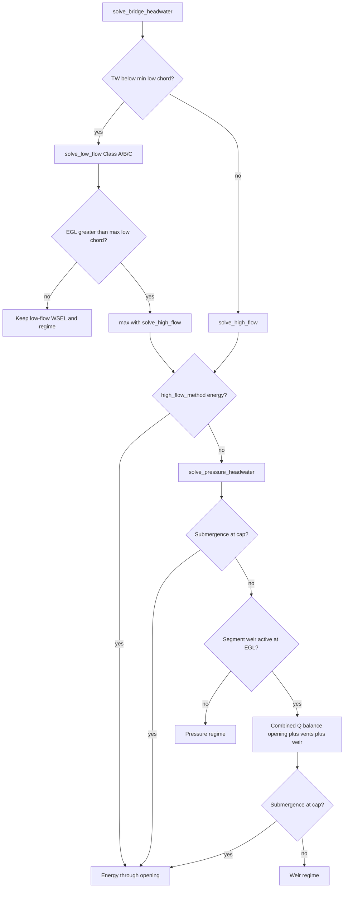

# 4.1 Pressure / weir / combined-flow transition — HEC-RAS audit

**Phase 4.1 audit · Phase 4.2 fixes** — documents HEC-RAS 6.x 1D bridge high-flow parity, transition edge cases, and **known remaining intentional deltas** (see [§ Intentional remaining deltas](#intentional-remaining-deltas)).

**Implementation references:** [`bridge.rs`](../../src/solvers/bridge.rs) (`solve_high_flow`, `combined_high_flow_discharge`, `apply_low_flow_pressure_check`), [`equations.md`](../reference/equations.md) §E–§F, [`hecras_parity.md`](../reference/hecras_parity.md).

**HEC-RAS reference:** [High flow through bridges](https://www.hec.usace.army.mil/confluence/rasdocs/ras1dtechref/6.3/modeling-bridges/hydraulic-computations-through-the-bridge/high-flow-through-the-bridge) (pressure orifice, weir overtopping, submergence, energy fallback).

---

## Regime map (after Phase 4.2)

| Regime label (`flow_regime`) | Solver path | HEC-RAS analogue |
|------------------------------|-------------|------------------|
| `low_a` / `low_b` / `low_c` | Low-flow methods; reconciled when `EGL > max(low chord)` | Class A/B/C low flow |
| `pressure` | Sluice and/or submerged orifice; opening + optional deck vents | High flow — pressure |
| `weir` | Combined overtopping balance | High flow — pressure + weir |
| `energy` | `bridge_high_flow_methods = 1` or submergence fallback | High flow — energy |

`flow_regime` is set from `BridgeHeadwaterSolve.regime` on the branch that governed the solve (since Phase 4.2).

---

## Deck profile extrema (partial submergence geometry)

When `bridge_deck_*` profiles are present, STREAM-1D stores four scalars (see `deck_extrema` in `bridge.rs`):

| Scalar | Definition | Used for |
|--------|------------|----------|
| `low_chord_m` | **Min** low elevation | Min opening height; low-flow vs high-flow branch (`TW < min low chord`) |
| `low_chord_max_m` | **Max** low elevation | Pressure trigger (`EGL > max low chord`); **sluice ↔ orifice switch** (`TW ≥ max low chord`) |
| `high_chord_m` | **Min** high elevation | Scalar fallback crest; submergence reference when no deck profile |
| `high_chord_max_m` | **Max** high elevation | Stored; not used in weir head today (see [intentional deltas](#intentional-remaining-deltas)) |

**Segment-wise behavior (partial deck):**

| Effect | STREAM-1D (Phase 4.2) | HEC-RAS (typical) | Status |
|--------|------------------------|-------------------|--------|
| Net opening area at low chord | `min(BU, BD)` × `profile_opening_area_factor` | BU/BD opening tables at WSEL | **Delta** — scalar factor, not WSEL-dependent (intentional approximation) |
| Sluice vs submerged switch | `TW ≥ low_chord_max_m` (max soffit) | Orifice when tailwater submerges opening | **Aligned** for uniform deck; haunched decks still use one global switch |
| Weir discharge | `segment_weir_discharge_m3s` per crest segment | Segment effective weir | **Aligned** (Phase 4.2) |
| Weir onset | Combined branch when EGL clears **any** segment crest | Partial overtopping | **Aligned** (Phase 4.2) |
| Submergence cap | Max segment ratio vs `max_weir_submergence` → energy | Bradley + user tolerance | **Aligned** (Phase 4.2) |

---

## Transition edge cases — known deltas

### 1. Low-flow → pressure handoff

| Topic | STREAM-1D | HEC-RAS | Severity |
|-------|-----------|---------|----------|
| Trigger from Class A/B/C | Low-flow WSEL `< low_chord_m` **and** upstream EGL `> low_chord_max_m` → replace with pressure (or energy) HW | High flow when head ponding under deck; compares methods | **Medium** |
| Skip pressure check | If low-flow WSEL `≥ low_chord_m`, go directly to `solve_high_flow` without `apply_low_flow_pressure_check` | RAS may still compare low-flow vs pressure | **Medium** — can miss max(low, pressure) when surface is above min soffit but EGL logic differs |
| Energy high-flow method | `bridge_high_flow_methods = 1` bypasses pressure/weir entirely | User-selectable energy high flow | **Low** (intentional) |

### 2. Sluice gate ↔ submerged orifice

| Topic | STREAM-1D | HEC-RAS | Severity |
|-------|-----------|---------|----------|
| Switch condition | `TW ≥ low_chord_m` (min) | Tailwater vs low chord | **Medium** on haunched decks |
| Sluice equation | FHWA Y3/Z with `bridge_pressure_flow_coeffs_inlet`; drive `(y3 − 0.5Z + velocity head)` | HEC-RAS Fig. 5-5 family | **Low** (same family) |
| Submerged equation | `C A_net √(2g(E_up − TW))`; single `bridge_orifice_coeffs` | Submerged orifice on net area | **Low** |
| Drive head for vents | Same `E_up − TW` as main submerged orifice | N/A — no vent paths | **N/A** (extension) |

### 3. Pressure-only ↔ combined (opening + vents + weir)

| Topic | STREAM-1D | HEC-RAS | Severity |
|-------|-----------|---------|----------|
| Combined balance | `Q = Q_opening + Q_vents + Q_weir` when solved HW `> high_chord_m` (min crest) | Pressure + weir sum above roadway | **Low** for RAS without vents |
| Below min high chord | `solve_pressure_headwater` — **no weir term** even if local deck segments overtop | May still have partial weir on high segments | **Medium–high** on crowned/segmented decks |
| Deck vents | Parallel paths always in `pressure_flow_discharge` / combined total | Not modeled | **High** vs pure RAS imports — **intentional extension** |
| Partial vent fill | `A_vent = W′ × (min(WSEL, z_soffit) − z_invert)` | — | **N/A** |
| Slotted vent type | Slot weir below soffit, then full-slot orifice | — | **N/A** |

### 4. Weir submergence → energy fallback

| Topic | STREAM-1D | HEC-RAS | Severity |
|-------|-----------|---------|----------|
| Submergence metric | `(TW − crest)+ / (E_up − crest)` vs `high_chord_m` | Bradley-type submergence | **Low** |
| Factor | `bradley_weir_submergence_factor` (tabulated %) | Bradley (1978) | **Low** |
| Threshold | `bridge_max_weir_submergence` (default 0.98) | User tolerance | **Low** |
| Fallback | `solve_high_flow_energy` / WSPRO-style opening balance | Energy through bridge | **Medium** — fallback **excludes deck vents and explicit weir** |
| Failed bisection | Residual `−1` triggers fallback mid-search | — | **Low** (conservative) |

### 5. Partial deck submergence (worked scenarios)

| Scenario | Expected physics | STREAM-1D behavior | vs HEC-RAS |
|----------|------------------|-------------------|------------|
| TW below min soffit, HW above min soffit | Sluice under deck | Sluice path; `a_net` may be reduced by profile factor | Similar if single chord |
| TW above min soffit, HW below min high chord | Submerged orifice only | Opening + vents; **no weir** | Similar (no vents in RAS) |
| HW above local crest, below min global high chord | Partial roadway overtopping | **No weir Q** until min crest cleared | **Delta** — RAS may add segment weir |
| Vents only carry extra Q | Lower HW at same Q | Documented in tests (`test_partially_submerged_deck_with_vents`) | **Extension** — lowers HW vs RAS |
| Vents + opening satisfy Q before weir | HW stays below min high chord | Observed in tests at Q≈150 vs Q≈300 for weir | **Extension / transition** |

### 6. Split regimes and reporting

| Topic | STREAM-1D | HEC-RAS | Severity |
|-------|-----------|---------|----------|
| Regime enum | `low_a`, `low_b`, `low_c`, `pressure`, `weir`, `energy` | Separate method reports per bridge | **Low** |
| Regime vs physics | Label from TW/WSEL scalars, not post-solve residual | — | **Medium** for diagnostics |
| Supercritical steady | `solve_bridge_tailwater` inverts pressure/combined | Similar inversion | **Low–medium** (limited golden tests) |
| Unsteady bridges | Post-step explicit coupling (≤5 iterations) | Implicit in network solver | **Medium** (architecture) |

### 7. Energy high-flow method gaps

| Topic | STREAM-1D | Notes |
|-------|-----------|-------|
| Deck vents | **Not included** in `solve_high_flow_energy` | Vents only in pressure/weir path |
| Weir term | **Not included** | By design when method = energy |
| WSPRO coupling | Uses low-flow WSPRO/energy opening loss when configured | Matches HEC pattern |

---

## Summary matrix (priority for Phase 4.2)

| ID | Delta | Severity | Suggested follow-up |
|----|-------|----------|---------------------|
| P1 | Weir Q zero until **min** high chord even when segment crests overtopped | Medium–high | Segment-wise weir head or earlier combined branch |
| P2 | Low-flow skip of `apply_low_flow_pressure_check` when WSEL ≥ min low chord | Medium | Always `max(low, pressure)` when EGL > max low chord |
| P3 | Sluice/orifice switch on **min** low chord with haunched profile | Medium | Local TW vs segment low chord |
| P4 | `flow_regime` label vs actual equation set | Medium | Derive label from solver branch taken |
| P5 | Energy fallback omits deck vents | Medium | Add vent paths or document as limitation |
| P6 | Deck vents vs HEC-RAS imports | High (expected) | Importers omit vents; document in parity |
| P7 | No HEC-RAS golden HW for pressure/weir/combined | Test gap | `python/verification` high-flow benchmarks |
| P8 | `profile_opening_area_factor` vs WSEL-dependent opening | Low–medium | Integrate opening area at solve WSEL |

---

## Existing test coverage (relevant)

| Test | What it guards |
|------|----------------|
| `test_partially_submerged_deck_with_vents` | Pressure regime; partial vent area; opening + vents balance |
| `test_combined_high_flow_opening_vents_weir_sum_to_q` | Combined Q at HW > min high chord |
| `test_combined_high_flow_weir_only_when_below_high_chord` | Weir term zero below min high chord |
| `test_deck_vents_reduce_headwater_when_main_opening_submerged` | Vents lower HW under submerged deck |
| Low-flow / BU-BD / abutment verification | **Not** high-flow pressure/weir golden vs HEC |

---

## Checklist (Phase 4.1)

- [x] **Audit** — partial deck submergence, split regimes, combined-flow transitions (this document)
- [x] **Benchmarks** — [`bridge_high_flow_hecras.json`](../../verification/fixtures/bridge_high_flow_hecras.json) (6 cases, ±2 mm); `tests/bridge_high_flow_hecras_verification.rs`
- [x] **Fixes** — iteration order, regime selection, submergence caps (Phase 4.2 — see below)
- [x] **Regime reporting** — `flow_regime` from solver branch (`BridgeHeadwaterSolve`)
- [x] **Docs** — known remaining intentional deltas ([§ Intentional remaining deltas](#intentional-remaining-deltas))

---

## Intentional remaining deltas

These are **expected** differences from HEC-RAS 6.x 1D. They are not scheduled for “parity fixes” unless noted as future work.

### Extensions (by design — not in HEC-RAS)

| Feature | STREAM-1D | HEC-RAS | Host / import guidance |
|---------|-----------|---------|------------------------|
| **Deck vents / slots** | Optional `bridge_deck_vent_*`; parallel $Q_{vents}$ in pressure and combined high flow | No separate vent fields | **Omit** for pure RAS imports. Supply when as-built grates/slots should not distort the main deck profile. Expect **lower** STREAM HW vs RAS when real vents exist. See [`deck_vents_slotted_openings.md`](deck_vents_slotted_openings.md). |
| **Slotted vent type** | Type `1`: slot weir below soffit, then full-slot orifice | — | Extension only. |
| **Explicit energy high flow** | `bridge_high_flow_methods = 1` always uses opening energy balance | User-selectable | Intentional API mirror; reported as `energy`. |

### Documented limitations (approximation vs RAS — not bugs)

| Topic | STREAM-1D today | HEC-RAS | Notes |
|-------|-----------------|---------|-------|
| **Opening area under haunched deck** | Single `profile_opening_area_factor` at min low chord | Opening area varies with WSEL along profile | May under/over-estimate $A_{net}$ at high ponding. Future: integrate at solve WSEL (P8). |
| **Sluice opening depth $Z$** | `opening_height_below_deck_m`: min (min low − bed) at BU/BD | Local opening depth | Conservative on asymmetric beds. |
| **Sluice/orifice switch on haunched deck** | One global switch at **max** low chord | Per-segment tailwater vs soffit | Simpler than segment-wise switch; aligned for uniform soffit. |
| **`high_chord_max_m`** | Stored; weir uses per-segment crests when profile present | — | No user-facing effect when `bridge_deck_high_elevations` is supplied. |
| **Energy fallback path** | `solve_high_flow_energy` — opening only; **no deck vents, no explicit weir** | Energy through bridge opening | By design when submergence exceeds cap or method = energy. Vents do not carry flow on this branch. |
| **Unsteady bridge coupling** | Explicit post-step `solve_bridge_coupled` (≤5 passes / step) | Implicit in network Jacobian | Architecture choice; may differ on fast transients. |
| **Supercritical tailwater inverse** | Bisection on pressure/combined/energy | Similar | Limited HEC golden coverage. |

### Out of scope (product parity, not high-flow math)

| Topic | Status |
|-------|--------|
| Standalone inline weirs (non-bridge) | Not modeled — roadway overtopping only |
| Multi-reach unsteady bridge networks | Main-stem / single-reach only |
| HEC `.g01` import | Host responsibility |

### Closed in Phase 4.2 (no longer deltas)

| Former gap | Resolution |
|------------|------------|
| Weir zero until min WSEL high chord | Segment weir when EGL clears local crest |
| Skip pressure reconcile when WSEL ≥ min low chord | `reconcile_low_flow_with_high_flow` |
| Sluice switch on min low chord | Switch at `low_chord_max_m` |
| `flow_regime` vs solver path | Regime from `BridgeHeadwaterSolve` |
| Combined bisection bracket | Search below pressure-only HW when weir adds capacity |
| Scalar submergence only | Max ratio over active weir segments |

### Verification status

| Coverage | Status |
|----------|--------|
| Unit / integration (pressure, combined, vents, submergence) | `src/solvers/bridge_tests.rs` |
| HEC-RAS golden HW (sluice, submerged, combined, segment weir, energy) | [`verification/fixtures/bridge_high_flow_hecras.json`](../../verification/fixtures/bridge_high_flow_hecras.json) — **6 cases**, ±2 mm |

---

## Phase 4.2 fixes (implemented)

| ID | Fix | Implementation |
|----|-----|----------------|
| P1 | Segment-wise weir before min WSEL high chord | `segment_weir_discharge_m3s`; combined branch when `weir_flow_discharge > 0` at EGL, not `WSEL ≥ high_chord` |
| P2 | Low-flow / high-flow reconciliation | `reconcile_low_flow_with_high_flow` always runs when `EGL > low_chord_max`; no skip when `WSEL ≥ min low chord` |
| P3 | Sluice/orifice switch | Submerged orifice when `TW ≥ low_chord_max_m` (max soffit), not min |
| P4 | Regime reporting | `solve_bridge_coupled` uses `BridgeHeadwaterSolve.regime` from the path taken |
| P5 | Submergence cap | `max_active_weir_submergence_ratio` per segment crest; energy fallback when `≥ max_weir_submergence` (incl. post-combined check) |
| — | Combined bisection bracket | Search **below** pressure-only HW when weir adds capacity at that headwater |

**Tests:** `test_segment_weir_before_min_high_wsel`, `test_combined_regime_label_from_solver`, `test_weir_submergence_energy_fallback_at_cap`, `test_sluice_orifice_switch_uses_max_low_chord`.

---

## Importer / host guidance

1. **Pure HEC-RAS geometry** — omit `bridge_deck_vent_*`; expect **higher** STREAM HW when real vents exist in the field.
2. **Piecewise deck** — supply `bridge_deck_*`; scalar `bridge_low_chords` / `bridge_high_chords` should match profile extrema.
3. **Highly submerged weir** — set `bridge_high_flow_methods = 1` or accept energy fallback near `max_weir_submergence` (vents not modeled on energy path).
4. **Diagnostics** — use `flow_regime` from the solve; compare `wsel` and `bridge_high_flow_methods`, not TW/WSEL scalars alone.
5. **Intentional deltas** — full list in [§ Intentional remaining deltas](#intentional-remaining-deltas) above and [`hecras_parity.md`](../reference/hecras_parity.md#bridge-high-flow-intentional-remaining-deltas).
